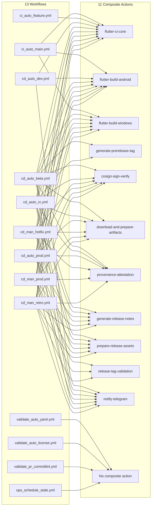

# GitHub Actions & CI/CD Documentation

**Last Updated:** 2026-04-15
**Maintainer:** @dencelkbabu
**Scope:** `.github/` directory (workflows, actions, dependabot)

## Overview

The `.github/` directory contains OpenMIDIControl's complete CI/CD infrastructure, implemented as **modular, reusable composite actions** following the DRY principle. All workflows follow the **`type_trigger_tier.yml`** naming convention and are pinned to specific action SHAs for supply chain security.

Development branch model:

- Feature/fix branches integrate through PRs into `dev`.
- `dev` is the default integration branch for both human and Dependabot changes.
- `beta` and `rc` are promotion branches for prerelease validation.
- `main` is stable-only and receives promoted changes after branch sync checks.

## Directory Structure

```
.github/
├── dependabot.yml              # Automated dependency update configuration (actions, npm, pub)
├── actions/                    # 11 reusable composite actions
│   ├── cosign-sign-verify/
│   ├── download-and-prepare-artifacts/
│   ├── flutter-build-android/
│   ├── flutter-build-windows/
│   ├── flutter-ci-core/
│   ├── generate-prerelease-tag/
│   ├── generate-release-notes/
│   ├── notify-telegram/
│   ├── prepare-release-assets/
│   ├── provenance-attestation/
│   └── release-tag-validation/
├── workflows/                  # 13 workflow files
│   ├── .yamllint               # YAML linting configuration
│   ├── cd_auto_*.yml           # Automated CD pipelines (dev, beta, rc, prod)
│   ├── cd_man_*.yml            # Manual CD pipelines (prod, hotfix, retro)
│   ├── ci_auto_*.yml           # Automated CI pipelines (main, feature)
│   ├── ops_*.yml               # Operational workflows (stale management)
│   └── validate_*.yml          # Validation workflows (license, yaml, commits)
└── ../.version                 # Version tracking for beta/RC workflows (root directory)
```

## Workflow Graph



## Workflow Naming Convention

All workflows follow the **`type_trigger_tier.yml`** pattern:

| Type | Description | Examples |
|------|-------------|----------|
| `cd_auto` | Automated Continuous Deployment | `cd_auto_dev.yml`, `cd_auto_prod.yml` |
| `cd_man` | Manual Continuous Deployment (requires approval) | `cd_man_prod.yml`, `cd_man_hotfix.yml` |
| `ci_auto` | Automated Continuous Integration | `ci_auto_main.yml`, `ci_auto_feature.yml` |
| `ops` | Operational/Management workflows | `ops_schedule_stale.yml` |
| `validate` | Code quality & compliance checks | `validate_auto_yaml.yml`, `validate_pr_commitlint.yml` |

## Composite Actions (Reusable Building Blocks)

### 1. `flutter-ci-core`
**Purpose:** Shared Flutter environment setup, static analysis, testing, Windows detection, and build metrics.

**Inputs:**
- `working-directory`: Path to Flutter project (default: `app`)
- `flutter-version`: Flutter version to use (optional, defaults to latest on channel)
- `telegram-token`: Telegram Bot Token (optional)
- `telegram-chat-id`: Target chat ID (optional)
- `notify-on-failure`: Whether to send failure notifications (default: `true`)
- `skip-format-check`: Skip dart format check for legacy code (default: `false`)

**Outputs:**
- `has_windows`: Whether the windows folder exists
- `job_status`: Status of the CI job (success/failure)
- `job_started_at`: Timestamp when the job started

**Steps:**
1. Cache Pub dependencies (`~/.pub-cache`)
2. Detect Windows platform support (`has_windows` output)
3. Setup Flutter (stable channel, cache enabled)
4. Run `flutter pub get`
5. Check code formatting (`dart format --output=none --set-exit-if-changed .`)
6. Static analysis (`flutter analyze --fatal-infos`)
7. Unit tests (`flutter test`)
8. Record build metrics (status, timestamp)
9. Send failure notification to Telegram (if enabled and credentials provided)

**Used by:** All CD workflows for pre-build validation

---

### 2. `cosign-sign-verify`
**Purpose:** Keyless Cosign signing and verification for artifact authenticity.

**Inputs:**
- `artifact_path`: Path to artifact to sign
- `repository`: GitHub repository slug (owner/repo)

**Steps:**
1. Sign artifact with Cosign (OIDC: `token.actions.githubusercontent.com`)
2. Generate `.sig` and `.pem` files
3. Verify signature with certificate identity regexp

**Security:** Uses GitHub's OIDC provider for keyless signing, eliminating secret management.

---

### 3. `provenance-attestation`
**Purpose:** Generate SLSA provenance attestation for build artifacts using GitHub native attestation.

**Inputs:**
- `subject_path`: Glob or exact path for artifact subjects (e.g., `openmidicontrol-*-android.apk`)

**Output:**
- GitHub-native provenance attestation (SLSA Level 2-3)

**Used by:** All CD workflows for supply chain security.

---

### 4. `flutter-build-android`
**Purpose:** Configure keystore (optional) and build Android APKs with optional ABI splitting.

**Inputs:**
- `working-directory`: Path to Flutter project (default: `app`)
- `keystore-base64`: Base64-encoded Android keystore (optional — required for `release` builds only)
- `key-password`, `key-alias`, `store-password`: Keystore credentials (optional — required for `release` builds only)
- `build-type`: `release`, `debug`, or `profile` (default: `release`)
- `split-per-abi`: Build separate APKs per ABI (default: `false`)
- `artifact-name`: Custom APK name (optional)

**Outputs:**
- `apk-path`: Path to built APK
- `apk-name`: APK filename

**Steps:**
1. Setup Java 17 (Temurin)
2. Setup Gradle with cache cleanup
3. Decode Base64 keystore to `upload-keystore.jks` (only if `keystore-base64` provided and `build-type` is `release`)
4. Generate `key.properties` with credentials (same condition)
5. Build APK with specified configuration
6. Upload artifact with custom naming

---

### 5. `flutter-build-windows`
**Purpose:** Build and ZIP Windows desktop application.

**Inputs:**
- `working-directory`: Path to Flutter project (default: `app`)
- `artifact-name`: Custom ZIP name (optional)

**Outputs:**
- `zip-path`: Path to built ZIP
- `zip-name`: ZIP filename

**Steps:**
1. Setup Flutter (stable, cache)
2. Check for `windows/` directory
3. Run `flutter build windows` (if directory exists)
4. ZIP build output to `openmidicontrol-{version}-windows.zip`
5. Upload artifact

---

### 6. `download-and-prepare-artifacts`
**Purpose:** Download build artifacts with pattern matching and merge support.

**Inputs:**
- `artifact-pattern`: Glob pattern (default: `*`)
- `merge-multiple`: Merge into single directory (default: `true`)

**Outputs:**
- `artifacts-dir`: Directory containing downloaded artifacts

**Used by:** Release publishing workflows to collect Android and Windows builds. Also downloads `release_notes.md` artifact for prerelease and stable publishing jobs.

---

### 7. `generate-release-notes`
**Purpose:** Parse CHANGELOG.md and generate release notes from conventional commits with full type detection.

**Inputs:**
- `tag`: Release tag (e.g., `v0.2.2` or `v0.2.2-beta.1`)
- `changelog-path`: Path to CHANGELOG.md (default: `CHANGELOG.md`)
- `include-metadata`: Include build metadata section (default: `true`)
- `commit-hash`: Commit hash for metadata (optional)
- `triggered-by`: Username who triggered the release (optional)
- `from-ref`: Explicit git reference for changelog (optional, **passed by workflows from `.version`**)
- `changelog-type`: `auto`, `full`, or `incremental` (default: `auto`)

**Outputs:**
- `notes-path`: Path to generated release notes file

**Features:**
- **Beta/RC/Hotfix Detection:** Automatically detects release type from tag pattern
- **Path-Based Changelog Routing:** Commits touching only `.github/` are routed to "CI/CD Infrastructure" section. Commits touching only `scripts/` are routed to "Development Tools" section. All other commits use type-based routing (Added, Fixed, Changed, etc.). This keeps infrastructure changes from polluting the main app changelog.
- **Conventional Commit Parsing:** Groups commits by type (Added, Fixed, Changed, etc.)
- **Smart Reference Resolution:** Finds previous beta/RC/stable tags via GitHub API or git describe
- **Commit Links:** Generates markdown links to individual commits
- **Type-Specific Formatting:** RC builds use "Release Candidate" headers; hotfixes use "Hotfix Release" headers
- **Fallback Handling:** Raw git log shown if no conventional commits detected
- **Note on `from-ref`:** Beta and RC workflows now pass `from-ref` explicitly from the `.version` file. The action's internal auto-detection logic is kept as a safety net for manual invocation but is redundant when called from automated workflows.

**Used by:** `cd_auto_prod.yml`, `cd_auto_beta.yml`, `cd_auto_rc.yml`, manual release workflows

---

### 7b. `generate-prerelease-tag`
**Purpose:** Generate deterministic beta/RC tags from `pubspec.yaml` + `.version` with safe fallbacks.

**Inputs:**
- `prerelease-type`: `beta` or `rc` (required)
- `pubspec-path`: Path to `pubspec.yaml` (default: `app/pubspec.yaml`)
- `version-file`: Path to `.version` file (default: `.version`)

**Outputs:**
- `prerelease-tag`: Generated tag (e.g., `v0.2.2-rc.1`)
- `from-ref`: Reference used for release notes diff
- `base-version`: Resolved base version before prerelease suffix

**Logic:**
1. Reads version from `pubspec.yaml`
2. If that version is already a stable git tag, falls back to `NEXT_PLANNED_VERSION` from `.version`
3. Increments the prerelease counter (`beta.1`, `beta.2`, etc.)
4. Resolves `from-ref` by finding the previous prerelease tag, or the last beta for RC.1, or the last stable release

**Used by:** `cd_auto_beta.yml` and `cd_auto_rc.yml`

---

### 8. `notify-telegram`
**Purpose:** Send enterprise-grade, context-aware build status and release notifications to Telegram (text and optional artifact document).

**Inputs:**
- `telegram-token`: Telegram bot token (secret)
- `telegram-chat-id`: Target chat ID (secret)
- `notification-type`: `ci-failure`, `release`, `dev-build`, `beta-build`, `rc-build`, `build-skipped`, `hotfix-release`
- `tag`: Release tag (for release/beta/rc notifications)
- `branch`: Branch name (for dev/CI notifications)
- `commit`: Commit SHA (optional, defaults to `github.sha`)
- `status`: `success` or `failure` (default: `success`)
- `custom-message`: Custom message text (overrides templates)
- `custom-message-is-html`: Treat custom message as trusted HTML (`false` by default)
- `artifact-path`: Path to artifact file to send (for dev builds)
- `changelog`: Raw changelog text (optional change snippet input)
- `release_reason`: Reason for release (optional)
- `skip_reason`: Reason for skipping release/build (optional)
- `patch_number`: Patch number (for hotfix notifications)
- `base_version`: Base version (for hotfix notifications)
- `rc_number`: RC number (for release candidate notifications)
- `is_first_rc`: Whether this is the first RC (true/false)
- `actor`: GitHub username who triggered the action (optional, defaults to `github.actor`)
- `mode`: `minimal`, `verbose`, or `enterprise`
- `environment`: `production`, `staging`, or `dev` (labeling)
- `failure-stage`, `failure-hint`: Structured diagnostics on failure paths
- `send-artifact`: Uploads `artifact-path` as Telegram document
- `buttons-enabled`: Enables inline keyboard buttons (Open Logs, Compare Changes, View Release)
- `fail-on-error`: Optional strict delivery mode for critical releases
- `notify-*regex` + `notify-status`: Noise control filters for branch/tag/type/status

**Design Decision:** All notification types (dev, beta, RC, release, hotfix, CI failures) route through this composite action for consistent enterprise formatting, diagnostics, and delivery controls.

**Features:**
- HTML parse mode with user-input escaping (prevents injection)
- Tiered layout (signal first, details later) with dynamic verbosity
- Inline keyboard buttons for action links
- Built-in retries, timeout, API success validation, and 429-aware backoff handling
- Pure-bash JSON extraction for Telegram API responses (no Python dependency)
- Optional artifact upload (`send-artifact: true`) with reply chaining
- Optional strict mode (`fail-on-error: true`) for critical production alerts
- Action outputs for delivery telemetry: `message-id`, `artifact-message-id`, `delivered`, `artifact-delivered`

**Runner requirement:** `notify-telegram` requires `bash` and `curl` on the runner.

**Used by:** All release workflows (beta, RC, prod, hotfix, manual) and CI failure notifications.

### Telegram Notification Types

The CI/CD pipeline sends the following Telegram messages across all workflows:

| # | Type | Workflow | Format | Content |
|---|------|----------|--------|---------|
| 1 | Dev Build | `cd_auto_dev.yml` | Enterprise message + artifact | Tiered message + action buttons + APK document |
| 2 | Beta Build | `cd_auto_beta.yml` | Enterprise message | Tiered message + action buttons + release link |
| 3 | RC Build | `cd_auto_rc.yml` | Enterprise message | Tiered message + action buttons + release link |
| 4 | Hotfix Release | `cd_man_hotfix.yml` | Enterprise message | Tiered message + trust signals + release link |
| 5 | Prod Release | `cd_auto_prod.yml` | Enterprise message | Tiered message + trust signals + release link |
| 6 | Manual Prod Rebuild | `cd_man_prod.yml` | Enterprise message | Tiered message + trust signals + release link |
| 7 | Manual Retro Rebuild | `cd_man_retro.yml` | Enterprise message | Tiered message + trust signals + release link |
| 8 | Build Failure | `cd_man_prod.yml`, `cd_man_retro.yml` | Enterprise failure message | Tiered message + diagnostics + action buttons |
| 9 | CI Pipeline Failed | all CI/CD workflows | Enterprise failure message | Tiered message + diagnostics + action buttons |
| 10 | Build Skipped | `cd_auto_rc.yml` | Enterprise warning message | Tiered message + skip reason + action buttons |
| 11 | Dev Build Failed | `cd_auto_dev.yml` | Enterprise failure message | Tiered message + diagnostics + action buttons |
| 12 | Beta Build Failed | `cd_auto_beta.yml` | Enterprise failure message | Tiered message + diagnostics + action buttons |
| 13 | RC Build Failed | `cd_auto_rc.yml` | Enterprise failure message | Tiered message + diagnostics + action buttons |
| 14 | Hotfix Failed | `cd_man_hotfix.yml` | Enterprise failure message | Tiered message + diagnostics + action buttons |
| 15 | Release Failed | `cd_auto_prod.yml`, `cd_man_prod.yml`, `cd_man_retro.yml` | Enterprise failure message | Tiered message + diagnostics + action buttons |

All notifications use a unified enterprise template with linked Repository, Branch/Tag, Commit, and Workflow URLs, plus consistent section labels and emoji markers.

**Standardized Message Vocabulary:**
- `🧭 Actions`
- `🛠 Diagnostics`
- `📊 Signals`
- `🛡 Trust Signals`

**Standardized Emoji Map:**
- Status: `🟢` success, `🔴` failure, `🟡` warning/skipped
- Ref/Environment: `🌿` ref, `🧩` dev, `🧪` staging, `🌍` production
- Security/Artifacts: `🔐` signed build, `📜` provenance, `🧾` SBOM, `📦` artifact

### HTML/CSS Telegram Preview

All 11+ Telegram message types have interactive HTML/CSS previews in `.github/notify-telegram-HTMLCSS-preview/`. These render pixel-accurate Telegram phone frame mockups for documentation and review purposes.

**Directory Structure:**
```
.github/notify-telegram-HTMLCSS-preview/
├── telegram-preview.html          # Index page with links to all previews
├── telegram-styles.css            # Shared CSS for all preview pages
├── telegram-01-dev-build.html     # Dev Build (enterprise message + artifact)
├── telegram-02-beta-build.html    # Beta Build (enterprise success)
├── telegram-03-rc-build.html      # RC Build (enterprise success)
├── telegram-04-hotfix.html        # Hotfix Release (trust signals profile)
├── telegram-05-prod-release.html  # Production Release (trust signals profile)
├── telegram-06-manual-prod.html   # Manual Prod Rebuild — Success
├── telegram-07-manual-retro.html  # Manual Retro Rebuild — Success
├── telegram-08-build-failure.html # Build Failure (diagnostics-expanded)
├── telegram-09-ci-failed.html     # CI Pipeline Failed (generic diagnostics)
├── telegram-10-skipped.html       # Build Skipped
└── telegram-11-truncated-message.html # Message truncation notice edge case
```

**Usage:** Open `telegram-preview.html` in any modern browser. Each preview page includes a "← All Previews" back link and a source note showing which workflow file generates the message.

**When to Update:**
- After modifying Telegram message templates in any workflow or composite action
- When adding new notification types
- When changing message formatting (HTML tags, structure, or fields)
- Before merging PRs that alter CI/CD notification behavior

---

### 9. `prepare-release-assets`
**Purpose:** Prepare the list of artifact files to be attached to a GitHub Release.

**Inputs:**
- `tag`: Release tag for artifact name prefix (required)
- `has-windows`: Whether Windows artifacts exist (required)
- `include-provenance`: Whether to include `.jsonl` provenance files (default: `true`)

**Outputs:**
- `files`: Newline-separated list of asset files to upload

**Steps:**
1. Scan for Android APK and signature files (`openmidicontrol-{tag}-android.{apk,sig,pem}`)
2. Scan for Windows ZIP and signature files (if `has-windows` is `true`)
3. Scan for provenance `.jsonl` files (if `include-provenance` is `true`)
4. Output file list as multiline string for use with `softprops/action-gh-release`
5. Log warnings for any missing files

**Used by:** All CD release workflows (`cd_auto_prod.yml`, `cd_auto_rc.yml`, `cd_auto_beta.yml`, `cd_man_hotfix.yml`, `cd_man_prod.yml`, `cd_man_retro.yml`)

---

### 10. `release-tag-validation`
**Purpose:** Validate release tag security invariants before production deployment.

**Inputs:**
- `tag`: Tag to validate (if empty, detects from `github.ref_name`)
- `allowed_actors`: Comma-separated allowlist of GitHub actors (empty means skip actor check)
- `gpg_public_key`: GPG public key content to import and validate tag signature
- `expected_fingerprint`: Expected GPG fingerprint for pinning
- `github_token`: GitHub token for API tag signature verification
- `main_branch`: Main branch to check ancestry against (default: `main`)

**Outputs:**
- `tag`: Resolved tag name
- `commit`: Tag commit hash
- `on_main`: Is tag on main branch (always `true` if validation passes)
- `has_windows`: Whether `app/windows` directory exists

**Validations:**
1. Actor validation (if `allowed_actors` provided)
2. Annotated tag requirement (`git cat-file -t` must be `tag`)
3. GPG signature verification with imported public key
4. Fingerprint pinning (prevents key substitution)
5. Main branch ancestry check (`git merge-base --is-ancestor`)
6. Tag retargeting protection (local vs remote commit comparison)
7. GitHub API tag signature verification (with retry logic, max 3 attempts)

**Used by:** Production release workflows as gatekeeper.

---

## Workflow Catalog

### Automated CD Pipelines (`cd_auto_*`)

#### `cd_auto_dev.yml`
**Trigger:** Push to `dev` branch
**Concurrency:** `dev-{workflow}-{ref}` (cancel-in-progress: true)

**Jobs:**
1. `analyze-and-test` - Flutter CI core (analysis + tests) — **Always runs** on push (skips for Dependabot)
2. `build-and-push-dev` - Build Android APK, normalize branch name, generate changelog from `git log`
3. Notify Telegram via `notify-telegram` composite action (enterprise profile) for success/failure paths

**Artifacts:** APK sent directly to Telegram — **no GitHub Release created**
**Notification:** Dev build APK with change summary attached to Telegram message

**Telegram Behavior:** Uses `notify-telegram` composite action with `send-artifact: true` to upload APK plus structured enterprise message.
**APK Naming:** Normalizes branch name (strips prefixes like `feature/`, `fix/`, trailing dates) and uses first 7 chars of SHA: `app-{clean-branch}-{short-sha}.apk`

---

#### `cd_auto_beta.yml`
**Trigger:** Push to `beta` branch
**Concurrency:** `beta-{workflow}-{ref}` (cancel-in-progress: true)

**Jobs:**
1. `analyze-and-test` - Flutter CI core — **Always runs** on push (skips for Dependabot)
2. `build-beta` - Reads `pubspec.yaml` version; if not yet a stable GitHub release, uses it. Otherwise falls back to `NEXT_PLANNED_VERSION` from `.version`. Generates sequential beta tag, builds Android APK
3. `build-windows` - Windows ZIP (if `windows/` directory exists) — conditional on `build-beta` success
4. `cosign-sign-verify` - Sign all artifacts with keyless OIDC
5. `provenance` - SLSA provenance attestation — conditional on build success
6. `create-pre-release` - **Public** prerelease with generated notes — conditional on provenance success (**not a draft**)
7. `notify-telegram` - Sends beta release notification via `notify-telegram` composite action

**Artifacts:** Signed APK + ZIP + Provenance (published to public prerelease)
**Notification:** Beta release enterprise notification with tiered layout and action buttons

**Version Tracking:** Reads `pubspec.yaml` first. If that version is not yet a stable GitHub release, it's used as the base. Otherwise falls back to `NEXT_PLANNED_VERSION` from `.version`. Tag generation: `v{version}-beta.1`, `v{version}-beta.2`, etc. See [Version Tracking](#version-tracking) below.

**Tag Visibility:** `cd_auto_beta.yml` fetches full git history and tags before prerelease detection to ensure the generated beta tag is created against the correct commit and avoids stale tag reuse.

**Telegram Behavior:** Uses the `notify-telegram` composite action (`notification-type: beta-build`) with standardized enterprise sections (`🧭 Actions`, `📊 Signals`) and a direct release link.
**Release Type:** Prerelease (immediately visible; no draft flag).

---

#### `cd_auto_rc.yml`
**Trigger:** Push to `rc` branch
**Concurrency:** `rc-{workflow}-{ref}` (cancel-in-progress: true)

`cd_auto_rc.yml` uses the same 7-stage prerelease pipeline as `cd_auto_beta.yml` and also fetches full git history and tags before prerelease tag generation.

**RC-specific differences:**
1. Uses `build-rc` and generates `v{version}-rc.N` tags (instead of beta tags)
2. Sends `notification-type: rc-build` in `notify-telegram`

**Artifacts/Release Type:** Same as beta — signed APK + optional Windows ZIP + provenance, published as a public prerelease.
**Version Tracking:** Same pubspec-first + `.version` fallback logic as beta. See [Version Tracking](#version-tracking).

---

#### `cd_auto_prod.yml`
**Trigger:** Push to `v[0-9]+.[0-9]+.[0-9]+` tags (SemVer tags)
**Concurrency:** `release-{workflow}-{ref}` (cancel-in-progress: true)

**Tag Visibility:** The production release workflow fetches full git history and tags before release notes generation and notification metadata collection.

**Jobs:**
1. `verify-tag-on-main` - Validates tag is annotated, GPG-signed, on main branch, not retargeted
2. `analyze-and-test` - Flutter CI core (skips if tag not on main)
3. `build-android` - Release APK with Cosign signing
4. `build-windows` - Windows ZIP with Cosign signing (if `windows/` exists)
5. `provenance` - SLSA provenance attestation
6. `publish-release` - Creates public GitHub release with generated notes
7. `notify-release` - Telegram notification via `notify-telegram` composite action

**Artifacts:** Signed APK + ZIP + Provenance (public GitHub release)
**Notification:** Production release announcement with download links

---

### Manual CD Pipelines (`cd_man_*`)

#### `cd_man_prod.yml`
**Trigger:** Manual dispatch (`workflow_dispatch`)
**Inputs:**
- `tag`: Tag to rebuild (e.g., `v1.0.2`)
- `force`: Force overwrite existing release assets (boolean)

**Jobs:**
1. `validate-tag` - Validates tag format, GPG signature, main branch ancestry
2. `analyze-and-test` - Restores modern CI actions from main, runs Flutter core
3. `build-android` - Release APK with Cosign signing
4. `build-windows` - Windows ZIP with Cosign signing (if `windows/` exists)
5. `provenance` - SLSA provenance attestation
6. `publish-release` - Updates GitHub release (deletes existing assets if `force` is true)
7. `notify-release` - Telegram notification with success/failure status

**Use Case:** Controlled production rebuilds for existing tags with optional force overwrite

---

#### `cd_man_hotfix.yml`
**Trigger:** Push to `v*-patch.*` tags (e.g., `v0.2.2-patch.1`)
**Category:** Auto-triggered CD (tag-based, not manual dispatch)

**Jobs:**
1. `verify-patch-tag` - Parses base version and patch number, determines if first patch
2. `analyze-and-test` - Flutter CI core
3. `build-hotfix` - Android APK (+ Windows if supported), Cosign signing
4. `provenance` - SLSA provenance attestation
5. `create-hotfix-release` - Public GitHub release with smart changelog (since stable for patch.1, since previous patch for subsequent)
6. `notify-telegram` - Hotfix release notification with patch number and base version

**Use Case:** Urgent production fixes deployed as patch releases (e.g., `v0.2.2-patch.1`, `v0.2.2-patch.2`)

---

#### `cd_man_retro.yml`
**Trigger:** Manual dispatch (`workflow_dispatch`)
**Inputs:**
- `tag`: Tag to rebuild (e.g., `v0.2.1`)
- `force`: Force overwrite existing release assets (boolean)

**Jobs:**
1. `validate-tag` - Validates tag format, GPG signature, main branch ancestry
2. `analyze-and-test` - Restores modern CI actions from main, runs Flutter core (with `skip-format-check: true`)
3. `build-android` - Release APK with Cosign signing
4. `build-windows` - Windows ZIP with Cosign signing (if `windows/` exists)
5. `provenance` - SLSA provenance attestation
6. `publish-release` - Updates GitHub release (deletes existing assets if `force` is true)
7. `notify-release` - Telegram notification with success/failure status and failure stage detection

**Use Case:** Retroactive rebuilds of historical tags with legacy CI action restoration from main branch

---

### Automated CI Pipelines (`ci_auto_*`)

#### `ci_auto_main.yml`
**Trigger:** Pull requests to `main` (promotion gate for `beta`/`rc`)
**Path filters:** none (runs on all PRs to `main` so promotion guard is always enforced)

**Jobs:**
1. `pre-main-sync` - For PRs from `beta`/`rc` into `main`, verifies release branch head is already present in `origin/dev`

**Purpose:** Enforce dev-first promotion integrity before stable merges into `main`

---

#### `ci_auto_feature.yml`
**Trigger:** Push to all branches except `main`, `dev`, `beta`, `rc`, `dependabot/**`; plus PRs targeting `dev`
**Path filters:** `app/**`, `.github/**`, `scripts/**`, `pubspec.yaml` (excludes `*.md`, `docs/**`, `.github/notify-telegram-HTMLCSS-preview/**`)

**Jobs:**
1. `analyze-and-test` - Flutter CI core (includes Dependabot PRs targeting `dev`)

**Purpose:** Validate feature branches and Dependabot PRs before integration into `dev`

---

### Validation Workflows (`validate_*`)

#### `validate_auto_yaml.yml`
**Trigger:** Push to `dev` and PRs targeting `dev`, `release/**`, `hotfix/**` when modifying `.github/**` (excluding `*.md` files and `.github/notify-telegram-HTMLCSS-preview/**`)
**Jobs:**
1. `yaml-lint` - YAML syntax validation using `.github/workflows/.yamllint` (ibiqlik/action-yamllint v3.4.0)
2. `actionlint` - GitHub Actions workflow schema validation (rhysd/actionlint v1.7.12)

**Configuration (`.github/workflows/.yamllint`):**
- Document start markers required (`---`)
- Line length: 150 (warning)
- Trailing spaces: warning
- Newlines: Unix (LF only)
- Comments: 1 space minimum from content
- Truthy values: `true`, `false`, `on`, `off` allowed (warning)

---

#### `validate_auto_license.yml`
**Trigger:** Push to `dev`; PRs targeting `dev`, `release/**`, or `hotfix/**`
**Path filters:** `**` with exclusions for `**/*.md`, `docs/**`, `.github/notify-telegram-HTMLCSS-preview/**`
**Jobs:**
1. `license-check` - Run `scripts/check_license_headers.py`

**Validation:**
- Checks all Dart, Kotlin, PowerShell, YAML, Python, Shell files
- Requires copyright notice + SPDX identifier
- Exit code 1 on failure (CI gate)
- Dependabot PRs excluded

---

#### `validate_pr_commitlint.yml`
**Trigger:** PR to `dev`, `release/**`, `hotfix/**` (types: `opened`, `synchronize`, `reopened`, `ready_for_review`)
**Concurrency:** `commitlint-{workflow}-{pr-number}` (cancel-in-progress: true)
**Jobs:**
1. `commitlint` - Validate all commits in PR using conventional commits (Node.js 20, `commitlint.config.js`)

**Configuration:**
- Skips draft PRs (`github.event.pull_request.draft == false`)
- Skips Dependabot PRs
- Validates from PR base SHA to head SHA
- Verbose output showing all violations

---

### Operational Workflows (`ops_*`)

#### `ops_schedule_stale.yml`
**Trigger:** Weekly cron (`0 0 * * 0`)  
**Jobs:**
1. `stale` - Mark and close inactive issues/PRs

**Configuration:**
- Stale threshold: 60 days
- Close after: 14 days (grace period)
- Exempt labels: `bug`, `security`
- Pinned to `actions/stale@b5d41d4e1d5dceea10e7104786b73624c18a190f` (v10.2.0)

**Messages:**
- Stale warning with closure timeline
- Closure notification with reason

---

## Version Tracking

The `.version` file (project root) is the **single source of truth** for beta and RC workflows. It contains:

```
CURRENT_STABLE_RELEASE_VERSION=0.2.1
NEXT_PLANNED_VERSION=0.2.2
```

### Fields

| Field | Purpose | Used By |
|-------|---------|---------|
| `CURRENT_STABLE_RELEASE_VERSION` | Latest stable release available to users | Baseline `from-ref` for release notes diffs and compare context |
| `NEXT_PLANNED_VERSION` | Version currently being developed | Fallback tag generation when `pubspec.yaml` version is already stable |

### How Workflows Use It

1. **`cd_auto_beta.yml`** and **`cd_auto_rc.yml`** read `pubspec.yaml` first, then check if `v{version}` exists as a git tag. If the tag exists (version is finalized), fall back to `NEXT_PLANNED_VERSION` from `.version`. If no tag exists yet, use the pubspec version directly (e.g., `pubspec=0.2.2` with no `v0.2.2` tag → `v0.2.2-beta.1`).

   Both workflows fetch full git history and tags before prerelease tag generation to ensure tag visibility and prevent stale or reused tags.
2. Tag generation is centralized in the `generate-prerelease-tag` composite action and reads both `app/pubspec.yaml` and `.version`.
3. `from-ref` is resolved by the composite action using previous prerelease tags, then stable-version fallback (`CURRENT_STABLE_RELEASE_VERSION`), then `git describe`.
4. Beta/RC notification jobs call `notify-telegram` composite action for enterprise notifications with standardized labels and emoji markers.

### When to Update

- **`NEXT_PLANNED_VERSION`**: Update **before** starting work on the next version (e.g., when branching for v0.3.0 development).
- **`CURRENT_STABLE_RELEASE_VERSION`**: Update **after** a stable release is published.
- **Both fields**: Must be kept in sync with `app/pubspec.yaml`. When you bump the version in `pubspec.yaml`, also update `.version`.

**Important workflow behavior:** The prerelease tag action checks whether the stable git tag `v{version}` exists. If it exists, the workflow falls back to `NEXT_PLANNED_VERSION`; if it does not exist, it uses the pubspec version directly.

**What version to use next?** Refer to [IMPLEMENTATION.md](../IMPLEMENTATION.md) for the planned future versions and their scope. Each milestone (v0.2.3, v0.3.0, v0.4.x, etc.) has a defined scope so you know which version number to set when starting new work.

### Versioning Example: Moving to v0.3.0

```
# Before starting v0.3.0 development:
CURRENT_STABLE_RELEASE_VERSION=0.2.1
NEXT_PLANNED_VERSION=0.2.2

# After v0.2.2 stable release, preparing v0.3.0:
CURRENT_STABLE_RELEASE_VERSION=0.2.2
NEXT_PLANNED_VERSION=0.3.0
```

Push to `beta` → creates `v0.3.0-beta.1`  
Push to `rc` → creates `v0.3.0-rc.1`

---

## Dependabot Configuration

**File:** `.github/dependabot.yml`

### GitHub Actions
- **Schedule:** Weekly (Sunday 04:00 Asia/Kolkata)
- **Target branch:** `dev`
- **Commit prefix:** `ci(actions)`
- **Grouping:** `security-updates` (`applies-to: security-updates`), `actions-minor-patch` (minor/patch), `actions-major` (major)

### NPM
- **Schedule:** Weekly (Sunday 04:00 Asia/Kolkata)
- **Target branch:** `dev`
- **Commit prefix:** `chore(npm)`
- **Grouping:** `security-updates` (`applies-to: security-updates`)

### Flutter/Pub
- **Schedule:** Weekly (Sunday 04:00 Asia/Kolkata)
- **Directory:** `app/`
- **Target branch:** `dev`
- **Commit prefix:** `chore(deps)`
- **Grouping:** `security-updates` (`applies-to: security-updates`), `minor-and-patch` (minor/patch), `major-updates` (major)
- **Limit:** 5 open PRs maximum

**Security behavior:** Security updates are grouped separately via Dependabot `applies-to: security-updates` rules across all configured ecosystems.

**Exemptions:** Dependabot PRs skip `validate_*` workflows to reduce CI noise, but Dependabot PRs to `dev` still run `ci_auto_feature.yml`.

---

## YAML Linting Configuration

**File:** `.github/workflows/.yamllint`

```yaml
# Rules enforced on all workflow files
rules:
  document-start: enable          # Requires --- at file beginning
  line-length:                    # Max 150 chars (warning)
    max: 150
    level: warning
  trailing-spaces: warn
  comments:
    min-spaces-from-content: 1
  new-lines:
    type: unix                   # LF only
  truthy:
    allowed-values: [true, false, on, off]
    level: warning
```

**Applied to:** `.github/workflows/*.yml`, `.github/actions/*/action.yml`

---

## Security Model

### Supply Chain Security
1. **Pinned Actions:** All third-party actions pinned to commit SHAs (not tags)
2. **Cosign Signing:** Keyless OIDC signing with GitHub OIDC issuer
3. **SLSA Provenance:** Native GitHub attestation for production builds
4. **GPG Verification:** Optional tag signature verification in `release-tag-validation`

### Secret Management
**Required Repository Secrets:**
- `TELEGRAM_TOKEN` - Bot token for notifications
- `TELEGRAM_CHAT_ID` - Target chat for messages
- `KEYSTORE_BASE64` - Base64-encoded Android signing keystore
- `KEY_PASSWORD` - Keystore key password
- `KEY_ALIAS` - Keystore key alias
- `STORE_PASSWORD` - Keystore store password

**Optional Secrets:**
- `GPG_PUBLIC_KEY` - For release tag verification
- `EXPECTED_GPG_FINGERPRINT` - Expected GPG key fingerprint
- `ALLOWED_RELEASE_ACTORS` - Comma-separated list of users who can trigger releases

### OIDC-First Integrations
When integrating external services (artifact storage, registries, cloud signing, deployment APIs), prefer GitHub OIDC federation over static long-lived credentials.

Current OIDC usage in this repository:
- Keyless Cosign signing via `token.actions.githubusercontent.com`
- Provenance/attestation jobs with explicit `id-token: write`

Policy for new integrations:
- Use OIDC trust relationships wherever supported
- Do not add static cloud access keys when OIDC is available
- Keep `id-token: write` scoped only to jobs that actually request federation tokens

### Permissions
All workflows use **least-privilege permissions**:
- Workflow baseline: `contents: read`
- Every job defines explicit `permissions:` at job level
- Release publishing jobs elevate to `contents: write` only where release/tag mutation is required
- OIDC/attestation jobs explicitly request `id-token: write` and `attestations: write`
- Operational stale management is scoped to `issues: write` and `pull-requests: write` only in the stale job

---

## Design Notes

### CI Execution Policy

- `analyze-and-test` is the default quality gate for active CI/CD paths.
- Validation workflows are scoped by branch and path filters to reduce redundant runs while preserving required protections.
- Promotion integrity is enforced by `ci_auto_main.yml` through the `pre-main-sync` job for `beta`/`rc` to `main` merges.

### Notification Architecture

- All notification types route through `notify-telegram` to keep formatting, diagnostics, and delivery behavior consistent.
- Runtime notifications and HTML preview artifacts use a shared vocabulary (`🧭 Actions`, `🛠 Diagnostics`, `📊 Signals`, `🛡 Trust Signals`).
- Beta and RC notification jobs include repository checkout and strict regex/status gates (`notify-*regex`, `notify-status`) to reduce chat noise.
- Telegram delivery is resilience-oriented: retries, timeout handling, API-level success checks, and long-message truncation safeguards.

### Workflow and Naming Baseline

- Workflows follow `type_trigger_tier.yml` naming.
- Legacy workflow names may appear in commit history, but this document treats the current names as canonical.
- Workflow/job gating is implemented with native GitHub `if:` conditions to avoid extra runner jobs.

---

## Troubleshooting

### Workflow Failures

**Symptom:** `validate_auto_yaml.yml` fails on push  
**Cause:** YAML syntax error or missing document start marker  
**Fix:** Run `python scripts/validate_workflows.py .github/workflows/your-file.yml` locally

**Symptom:** `validate_auto_license.yml` fails  
**Cause:** Missing SPDX license header in source file  
**Fix:** Run `python scripts/add_license_headers.py` to auto-add headers

**Symptom:** `validate_pr_commitlint.yml` fails  
**Cause:** Commit message doesn't follow conventional commits format  
**Fix:** Amend commit with proper format: `git commit --amend -m "type(scope): message"`

**Symptom:** Android build fails with keystore error  
**Cause:** Missing or invalid GitHub secrets  
**Fix:** Verify `KEYSTORE_BASE64`, `KEY_PASSWORD`, `KEY_ALIAS`, `STORE_PASSWORD` in repository settings

**Symptom:** Telegram notification not sent  
**Cause:** Invalid bot token or chat ID  
**Fix:** Test with `curl` using token from repository secrets

---

## Local Development

### Validate Workflows Locally

```bash
# Validate all workflows
python scripts/validate_workflows.py .github/workflows/*.yml

# Validate specific workflow
python scripts/validate_workflows.py .github/workflows/cd_auto_prod.yml

# Auto-fix common issues (CRLF, trailing spaces, emojis)
python scripts/validate_workflows.py --fix .github/workflows/*.yml
```

### Check License Headers

```bash
# Check all files for license headers
python scripts/check_license_headers.py

# Auto-add missing headers
python scripts/add_license_headers.py
```

### Test Commit Messages

```bash
# Install dependencies
npm install

# Test commit message format
npx commitlint --from HEAD~3 --to HEAD --verbose
```

---

## Contributing

When adding new workflows or actions:

1. **Follow naming convention:** `type_trigger_tier.yml`
2. **Pin all actions to SHAs:** Never use tags (e.g., `@v4` → `@de0fac2e4500dabe0009e67214ff5f5447ce83dd`)
3. **Add license headers:** Include copyright and SPDX identifier at top
4. **Document inputs/outputs:** Use composite action metadata format
5. **Test locally:** Run `python scripts/validate_workflows.py` before pushing
6. **Update this doc:** Add new workflows to the catalog above

---

## References

- [GitHub Actions Documentation](https://docs.github.com/en/actions)
- [Reusable Composite Actions](https://docs.github.com/en/actions/creating-actions/creating-a-composite-action)
- [Cosign Keyless Signing](https://docs.sigstore.dev/signing/quickstart)
- [SLSA Provenance](https://slsa.dev/provenance/v1)
- [Conventional Commits](https://www.conventionalcommits.org/)
- [Dependabot Configuration](https://docs.github.com/en/code-security/dependabot/dependabot-version-updates/configuration-options-for-the-dependabot.yml-file)
